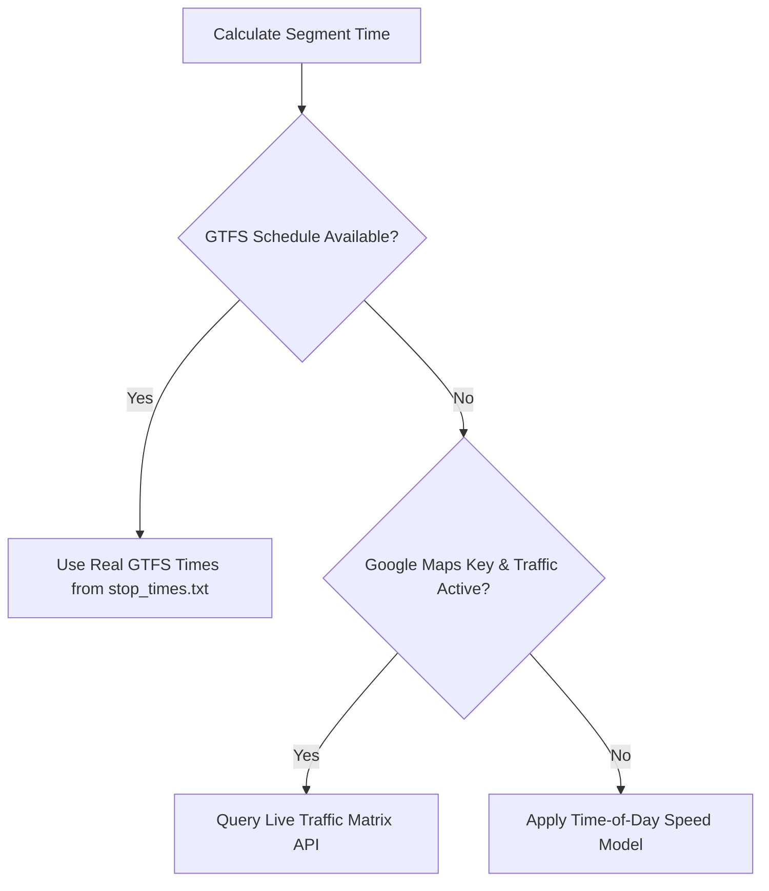

# UTRS Bengaluru - BMTC Module Implementation Handbook

This handbook provides a complete technical guide to the implementation details, features, algorithms, workflow, and datasets used in the BMTC (Bangalore Metropolitan Transport Corporation) transit planning module of the Unified Transit Routing System (UTRS) for Bengaluru.

---

## 1. Directory Structure

The BMTC module is structured into core database loaders, pathfinding layers, scheduling utilities, and endpoint integrations:

```
backend/modes/bmtc/
├── core/
│   ├── __init__.py
│   ├── config.py              # Settings: speeds, fare tables, toll surcharges, file paths
│   ├── graph.py               # Graph representation, Dijkstra & multi-option routers
│   ├── gtfs.py                # GTFS parser (stops.txt, routes.txt, trips.txt, stop_times.txt)
│   ├── loader.py              # Primary database loader for stops, reverse routes, and schedules
│   └── stops.py               # Stop lookup utilities and helper functions
└── features/
    ├── __init__.py
    ├── fare.py                # Distance-based pricing slabs (Ordinary, Vajra, AC, Tolls)
    ├── journey.py             # Journey result formatting wrappers
    ├── routing.py             # Direct bus routing, corridor intersection, transfer suggestor
    └── schedule.py            # Time-of-day speeds, GTFS arrival search, waiting buffers
```

---

## 2. Datasets & Data Processing

The routing system builds on two categories of transit datasets under the `database/bmtc/` directory:

### GTFS Raw Data
* **`routes.txt`**: Mapping of GTFS route IDs to public route numbers (e.g. `500C`, `360-K`).
* **`trips.txt`**: Sequence of trips associated with each route, defining daily frequencies.
* **`stop_times.txt`**: Arrival/departure schedule timings for trips.
* **`stops.txt`**: Geolocation coordinates (Latitude/Longitude) of all physical bus stops.

### Cleaned & Augmented Data
* **`stops_clean.csv`**: Cleansed stops dataset with uniform casings and coordinate mappings.
* **`stop_clusters.csv`**: Maps `(route_no, stop_sequence)` tuples to a spatial `final_cluster` ID. This resolves the **Location Collision Bug** (e.g., stops with identical names located in different regions of the city, preventing false transfers).
* **`reverse_routes_supplement.csv`**: Contains returning route paths (appended with a `_REV` suffix, e.g. `360-K_REV`) to allow bidirectional transit queries.
* **`stop_canonical_names.csv`**: Clean mappings for synonymous stops.

---

## 3. Graph Construction & Proximity Indexing

At startup, the graph builder in [graph.py](file:///c:/Users/Harsh/Downloads/BMTC_fixed/backend/modes/bmtc/core/graph.py) constructs a route-aware, frequency-weighted transit network.

### Node Representation
Graph nodes are defined as `(cluster_key, route_no)` pairs, where:
* `cluster_key` is a location-aware identifier from `stop_clusters.csv` (or falls back to `stop_norm`).
* `route_no` is the bus route number.
This ensures same-route contiguous stops are connected and prevents false transfers between separate physical stops that share the same name.

### Frequency Weighting Formula
To favor high-frequency corridors, edge weights are scaled down logarithmically based on daily trip frequencies:
$$\text{weight} = \frac{\text{haversine\_distance\_km}}{\ln(1 + \text{trips\_per\_day})}$$
This heuristics-driven weight makes high-frequency lines cheaper for the search algorithm, reducing suggested waiting and transit times.

### Proximity Indexing (Grid-Bucket Spatial Index)
Precomputing walking transfer edges between all 5,000+ stops would suffer from $O(N^2)$ time complexity. To prevent this:
1. **Grid Partitioning**: Stops are divided into grid cells of size $\approx 210\text{m} \times 210\text{m}$ based on their coordinates.
2. **Local Bucket Search**: When checking proximity transfers (maximum walking distance of $200\text{m}$), the algorithm only evaluates stops in the target stop's grid cell and its 8 immediate surrounding cells.
3. This reduces the search complexity to $O(N)$ average time.

---

## 4. Pathfinding Algorithms

The BMTC planner employs two layers of pathfinding based on speed and complexity:

### A. Direct & Corridor Intersection Search
Located in [routing.py](file:///c:/Users/Harsh/Downloads/BMTC_fixed/backend/modes/bmtc/features/routing.py):
1. **Direct Buses**: Returns all routes containing the source stop prior to the destination stop in their stop sequence.
2. **Corridor Intersections (Fast Transfers)**: Finds intersections between routes passing through the source and routes passing through the destination. By joining them at the intersection stop, it quickly constructs 1-transfer routing options. This is highly performant and avoids executing full graph Dijkstra.

### B. Route-Aware Dijkstra Search
Exposed in [graph.py](file:///c:/Users/Harsh/Downloads/BMTC_fixed/backend/modes/bmtc/core/graph.py):
* **Single-Path Dijkstra (`dijkstra`)**: Finds the single best route minimizing transfers and frequency-weighted distance. 
* **Multi-Path Dijkstra (`dijkstra_all_options`)**: Returns up to $N$ alternative paths. It groups results by transfer level (0-transfers, 1-transfer, 2-transfers) and yields the best option for each level.

#### Transfer Edges
Transfers are handled dynamically inside the Dijkstra loop:
* **Same-stop transfers** (changing lines at the same physical cluster key) carry a weight penalty of $0$.
* **Proximity transfers** (walking to a nearby cluster key $\le 200\text{m}$) carry a walk penalty weight of $0.05$.

---

## 5. Scheduling & Travel Time Estimation

Calculations in [schedule.py](file:///c:/Users/Harsh/Downloads/BMTC_fixed/backend/modes/bmtc/features/schedule.py) resolve arrival/departure timings using a hierarchical lookup strategy:



### Time-of-Day Speed Fallback Model
If GTFS schedules are missing, travel times are estimated by dividing distance by dynamic speed limits:
* **Peak Hours** (08:00–11:30, 16:30–20:00): $14\text{ km/h}$
* **Day Hours** (05:00–08:00, 11:30–16:30, 20:00–22:00): $18\text{ km/h}$
* **Night Hours** (22:00–05:00): $22\text{ km/h}$

### Operational Constraints
* **Operational Window**: 05:00 to 23:30.
* **Chained Timing**: For transfer journeys, the departure time of the second leg is automatically chained to the arrival time of the first leg plus a $15\text{-minute}$ transfer buffer (`TRANSFER_TIME`) to ensure realistic journey planning.

---

## 6. Fare Calculation

Fares are resolved in [fare.py](file:///c:/Users/Harsh/Downloads/BMTC_fixed/backend/modes/bmtc/features/fare.py) by mapping distance to slab rates and adding surcharges:

### Slab Rates Table (in Rs.)

| Distance Slab | Ordinary Buses | Vajra (AC) Buses |
| :--- | :--- | :--- |
| $\le 2\text{ km}$ | ₹10 | ₹20 |
| $\le 4\text{ km}$ | ₹15 | ₹30 |
| $\le 6\text{ km}$ | ₹20 | ₹40 |
| $\le 10\text{ km}$ | ₹25 | ₹50 |
| $\le 15\text{ km}$ | ₹30 | ₹60 |
| $\le 20\text{ km}$ | ₹35 | ₹70 |
| $> 20\text{ km}$ | ₹40 (default) | ₹80 (default) |

### Surcharges
* **Electronic City (ELC) Flyover Surcharge**: +₹7
* **NICE Road Surcharge**: +₹5

---

## 7. Stop Name Normalization & Synonyms

To provide a seamless multimodal journey planner (linking bus and metro), UTRS implements a shared resolver utility [stop_resolver.py](file:///c:/Users/Harsh/Downloads/BMTC_fixed/backend/shared/utils/stop_resolver.py).

### Workflow
1. **Clean Input**: Strips prefix anomalies (e.g. `CS-`, `CS `).
2. **Slug Matching**: Translates synonyms/slugs (e.g. `KBS`, `Majestic`, `Kempegowda Bus Station`) into mode-specific canonical strings:
   * **BMTC Canonical**: `Kempegowda Bus Station`
   * **Metro Canonical**: `Majestic`
3. **Coordinate Alignment**: Resolves synonyms to coordinates in [main.py](file:///c:/Users/Harsh/Downloads/BMTC_fixed/backend/main.py) via `/api/stops/coords`, ensuring maps draw pins correctly for typed strings like `CS Hosa Road`.

---

## 8. Interactive Map Visualizations

The frontend [App.jsx](file:///c:/Users/Harsh/Downloads/BMTC_fixed/frontend/src/App.jsx) maps routes and stops using two interchangeable views:

### A. Google Map Overlay
* **Waypoints Drawing**: Calls `DirectionsService.route` with `travelMode: "DRIVING"`. It feeds the intermediate bus stops as `waypoints` (sub-sampled to a maximum of 15 to stay within API limits), forcing the route to match the actual streets of the transit corridor.
* **Metro Paths**: Draws clean straight `Polyline` elements colored using line-specific Hex codes:
  * **Green Line**: `#22c55e`
  * **Purple Line**: `#8b5cf6`
  * **Yellow Line**: `#eab308`
* **Custom Markers**: Puts circles on all intermediate stops. Hovering or clicking on a stop circle triggers an info tooltip displaying its name.

### B. Linear Route Schematic Map
Designed as a horizontal scrollable schematic (e.g. `---o---o---o---`):
* Differentiates nodes: start (green/large), end (red/large), transfer points (white-centered/large), and intermediate stops (small/solid).
* Visualizes connections using segment-specific transit colors.
* Places route number tags (e.g., `500C`, `Green Line`) directly above the connecting line segments.
