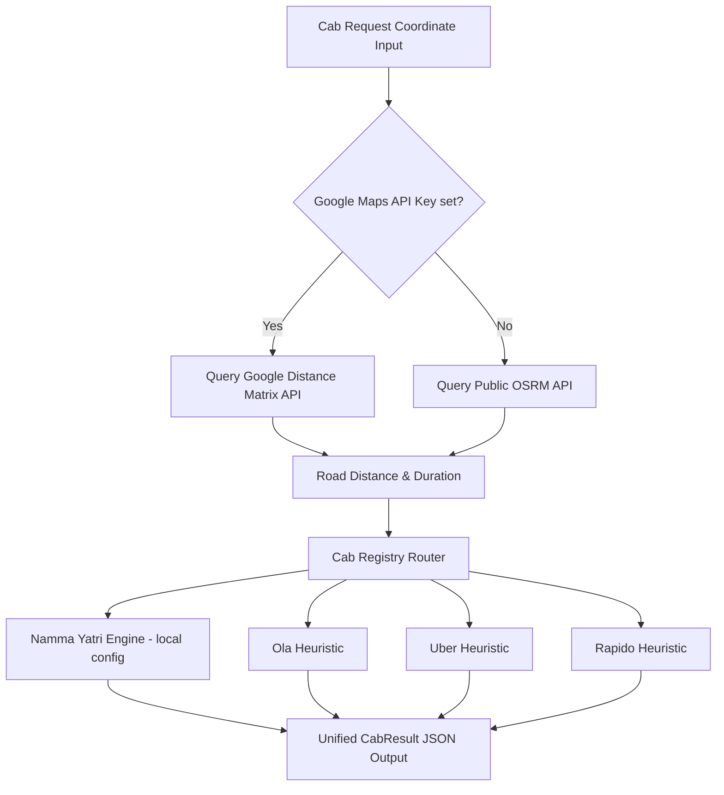

# Cab & Ride-Hailing Integration Specification

This document details the engineering specification for integrating ride-hailing services (Namma Yatri, Ola, Uber, and Rapido) into the UTRS transit engine.

## Architecture

The cab routing engine is a composite module that connects geographical coordinates to OSRM (Open Source Routing Machine) road distances, queries Namma Yatri's local pricing model, and computes calibrated heuristics for commercial providers.



---

## 1. Routing & Distance Methods

To avoid straight-line coordinate inaccuracies, cab routing uses two prioritized strategies:

### Primary Strategy: OSRM Public Routing API
Calculates actual street-network distance and duration:
* **Endpoint**: `https://router.project-osrm.org/route/v1/driving/{src_lng},{src_lat};{dst_lng},{dst_lat}`
* **Params**: `overview=false&steps=false`
* **Parsing**: Extract `distance` (meters → km) and `duration` (seconds → minutes) from response tracks.

### Secondary/Fallback Strategy: Haversine with Correction Coefficient
If APIs are offline, fallback calculations use the haversine formula multiplied by the Bengaluru road curvature correction coefficient ($C_{road} = 1.3$).

---

## 2. Pricing & Provider Models

UTRS aggregates options and normalizes them into a single schema.

### Namma Yatri (Config-Driven)
* **Logic**: Uses local YAML/JSON configurations reflecting Bengaluru's official auto and cab slabs.
* **Pricing Parameters**:
  * Auto: Base ₹30 (first 2 km), ₹15 per subsequent km.
  * Cabs: AC Cab, Non-AC Cab, XL Cabs.
* **Night Surcharge**: +50% applied between 22:00 and 05:00.

### Uber (Calibrated Heuristics)
* **Categories**: Uber Auto, Uber Go, Uber Premier, Uber XL.
* **Algorithm**:
  $$\text{Fare} = \max(\text{Base} + (\text{Distance} \times \text{Per-Km Rate}) + (\text{Duration} \times \text{Per-Minute Rate}), \text{Min Fare})$$
* **Dynamic Surge Multiplier**: Calculated based on simulated peak demand hours (08:30-10:30 and 17:30-20:30) with a factor of $1.25\times$.

### Ola (Calibrated Heuristics)
* **Categories**: Ola Auto, Ola Mini, Ola Prime.
* **Algorithm**: Matches Uber pricing but with slightly higher base rates and lower per-minute charges to reflect local market adjustments.

### Rapido (Calibrated Heuristics)
* **Categories**: Rapido Bike, Rapido Auto, Rapido Cab.
* **Algorithm**: Optimized for single-passenger speed. Bike fares feature a low base of ₹20 and lower per-km charges, making it the cheapest individual motor-vehicle option.

---

## 3. Data Contract (CabResult Schema)

All estimations return a standard JSON structure to the frontend React UI:

```json
{
  "provider": "Namma Yatri",
  "provider_key": "namma_yatri",
  "vehicle_key": "auto",
  "vehicle_name": "Auto",
  "description": "Eco Auto",
  "capacity": 3,
  "icon": "🛺",
  "vtype": "auto",
  "available": true,
  "mode": "cab",
  "distance": 8.4,
  "time": 22,
  "cost": 126,
  "cost_max": 135,
  "fare_display": "Rs. 126",
  "departure": "18:15",
  "arrival": "18:37",
  "guide": [
    {
      "step": 1,
      "icon": "cab",
      "text": "Book Auto on Namma Yatri",
      "duration": "~3 min pickup"
    },
    {
      "step": 2,
      "icon": "car",
      "text": "Ride to destination",
      "duration": "22 min"
    }
  ]
}
```
