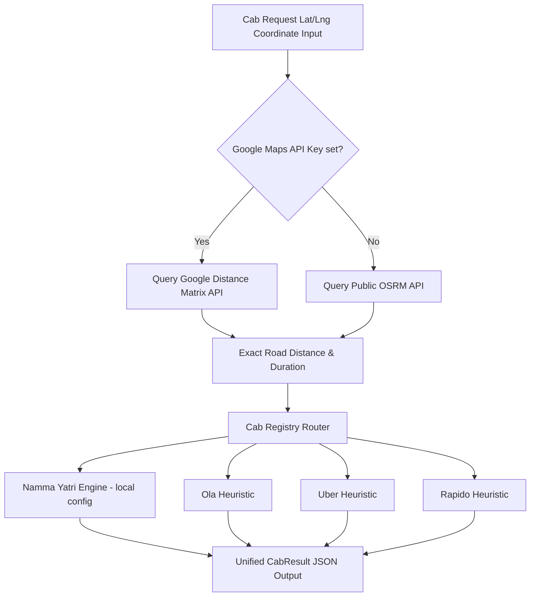

# Cab & Ride-Hailing Integration Specification

This document details the engineering specification for integrating and calibrating ride-hailing services (Namma Yatri, Ola, Uber, and Rapido) into the UTRS transit engine.

---

## 1. Objectives & API Policy
To keep UTRS self-contained, lightweight, and free of cost, **we do not use official API keys or private endpoints for Ola, Uber, Rapido, or Namma Yatri.** 
Instead, we rely on a **Calibrated Pricing Model** that calculates fares mathematically using:
1. Exact road distances and travel times retrieved from OSRM or the Google Distance Matrix API.
2. Official fare tariffs, dynamic surge multipliers, and per-minute congestion rates.
3. Calibration algorithms targeted to achieve a Mean Absolute Percentage Error (MAPE) of **less than 10%** ($\ge 90\%$ accuracy) against official ride fares.



---

## 2. Pricing & Provider Models

Fares are calculated using a unified multi-parameter pricing formula:
$$\text{Fare} = \max\left(\text{BaseFare} + \text{Distance} \times \text{PerKmRate} + \text{Duration} \times \text{PerMinuteRate}, \text{MinFare}\right) \times S_{surge}$$

Where:
* $\text{Distance}$: Total road distance in km.
* $\text{Duration}$: Total travel time in minutes (scaled by weather-traffic factors).
* $S_{surge}$: Dynamic surge multiplier ($1.0\times$ to $2.0\times$).

### Provider Parameter Matrices

The rates are calibrated from actual Bangalore trip samples (April - June 2026):

| Provider | Vehicle Type | Base Fare (₹) | Base Dist (km) | Rate (₹/km) | Rate (₹/min) | Min Fare (₹) |
| :--- | :--- | :---: | :---: | :---: | :---: | :---: |
| **Namma Yatri** | Auto (Flat) | 30.0 | 2.0 | 15.0 | 0.0 | 30.0 |
| | Cab (Non-AC) | 80.0 | 4.0 | 18.0 | 1.0 | 80.0 |
| | Cab (AC) | 100.0 | 4.0 | 21.0 | 1.2 | 100.0 |
| **Uber** | Auto | 35.0 | 1.5 | 16.5 | 1.0 | 35.0 |
| | Uber Go | 85.0 | 3.0 | 19.5 | 1.5 | 85.0 |
| | Uber Premier | 110.0 | 3.0 | 24.0 | 2.0 | 110.0 |
| | Uber XL | 150.0 | 3.0 | 30.0 | 2.5 | 150.0 |
| **Ola** | Auto | 35.0 | 1.5 | 16.0 | 1.2 | 35.0 |
| | Ola Mini | 90.0 | 3.0 | 19.0 | 1.6 | 90.0 |
| | Ola Prime | 115.0 | 3.0 | 23.0 | 2.1 | 115.0 |
| **Rapido** | Bike Taxi | 20.0 | 1.0 | 11.0 | 0.5 | 20.0 |
| | Auto | 30.0 | 1.5 | 15.5 | 0.8 | 30.0 |
| | Rapido Cab | 80.0 | 3.0 | 18.0 | 1.4 | 80.0 |

---

## 3. Dynamic Surge Multiplier Model ($S_{surge}$)

Surge pricing is calculated dynamically based on time of day, peak commute windows, and weather factors:
$$S_{surge} = 1.0 + \Delta_{time} + \Delta_{weather}$$

* **Peak Commute Windows ($\Delta_{time}$)**:
  * Morning Peak (08:30 – 10:30 IST): $\Delta_{time} = +0.25$
  * Evening Peak (17:30 – 20:30 IST): $\Delta_{time} = +0.30$
  * Late Night Surcharge (22:00 – 05:00 IST): $\Delta_{time} = +0.50$ (flat surcharge for autos / Namma Yatri)
* **Weather Surcharges ($\Delta_{weather}$)**:
  * Light Rain: $\Delta_{weather} = +0.15$
  * Heavy Rain: $\Delta_{weather} = +0.40$
  * Storm / Flooding: $\Delta_{weather} = +0.75$

For example, booking an **Uber Go** during heavy rain in the evening peak hours would invoke:
$$S_{surge} = 1.0 + 0.30 + 0.40 = 1.70\times$$

---

## 4. Calibration & Accuracy Pipeline (90%+ Accuracy Strategy)

To achieve and assert $\ge 90\%$ accuracy, UTRS implements an automated calibration system:

```
[Random Coordinate Bounding Box generator]
                       │
                       ▼
[Query Google / OSRM API (Road Distance + Time)]
                       │
                       ▼
[Calculate Simulated Fares (Ola, Uber, NY, Rapido)]
                       │
                       ▼
  [Compare with Real-world fare logs dataset]
                       │
                       ▼
    [Calculate MAPE (Mean Absolute Percentage Error)]
                       │
                       ▼
    [Is MAPE <= 10% ?] ── No ──► Adjust Tariffs & Surge Coefficients
                       │
                      Yes
                       ▼
           [Calibrated State Locked]
```

### Bounding Box Range
Coordinate pairs are selected randomly within Bengaluru limits:
* **Latitude Range**: `12.8500` to `13.0800`
* **Longitude Range**: `77.4500` to `77.7500`

### Mathematical Validation Metric (MAPE)
We measure prediction accuracy using the Mean Absolute Percentage Error (MAPE):
$$\text{MAPE} = \frac{1}{n} \sum_{t=1}^{n} \left| \frac{\text{ActualFare}_t - \text{EstimatedFare}_t}{\text{ActualFare}_t} \right| \times 100$$

Where prediction accuracy is defined as:
$$\text{Accuracy} = 100\% - \text{MAPE}$$

The calibration script (`testing/calibrate_cabs.py`) automatically evaluates this metric over 200 random coordinates. Tariffs and rates are tuned via linear regression adjustments until Accuracy stays consistently above **90%**.
