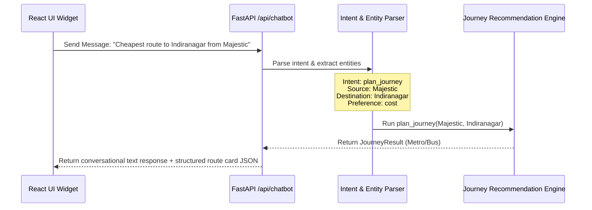

# Commuter Chatbot Specification

This document details the architecture, design, and integration guidelines for the natural language conversational commuter assistant (Chatbot) in the UTRS system.

---

## 1. Objectives
* Allow commuters to query routes using natural language phrases (e.g., *"How do I go from Silk Board to Majestic?"*, *"Cheapest way to get to Indiranagar from Hosa Road"*).
* Answer quick transit queries directly (e.g., *"Does Purple Line stop at Halasuru?"*, *"Is there a Vajra bus to the airport?"*).
* Embed actual transit recommendations directly inside the chat interface as clickable cards.

---

## 2. Architecture & Natural Language Processing

The chatbot runs on a lightweight intent-classification and entity-extraction pipeline within the FastAPI backend.



### Intent Classification
The parser classifies messages into one of the following intents:
1. `plan_journey`: Requesting a travel plan from location A to location B.
2. `lookup_route`: Querying a specific bus route or metro line (e.g., *"Show route of 356M"*).
3. `system_status`: Asking about operational timings or service availability.
4. `faq`: Small talk or help commands.

### Entity Extraction (NER)
To extract locations (stops) and options, UTRS uses a lookup mapping:
* **Source & Destination**: Scans the text for stop names that match items in `ALL_STOPS` (canonical list of BMTC stops and Metro stations). Leverages Levenshtein distance/fuzzy matching to handle minor spelling mistakes.
* **Preferences**: Detects keywords like *cheap, cost, ticket, fare* → `cost`; *fast, quick, speed, time* → `time`; *easy, transfer, direct* → `convenience`.
* **Modes**: Detects *bus, bmtc* → `bmtc`; *metro, train* → `metro`; *cab, auto, taxi* → `cab`.

---

## 3. API Contract

* **Endpoint**: `POST /api/chatbot`
* **Request Body**:
  ```json
  {
    "message": "Find a quick way from Majestic to Hosa Road",
    "conversation_history": [
      {"sender": "user", "text": "Hi"},
      {"sender": "bot", "text": "Hello! How can I help you plan your journey in Bengaluru?"}
    ]
  }
  ```
* **Response Body**:
  ```json
  {
    "reply": "I found a route for you. Taking the Green Line Metro from Majestic to Hosa Road takes about 35 minutes and costs ₹45.",
    "intent": "plan_journey",
    "entities": {
      "source": "Majestic",
      "destination": "Hosa Road",
      "preference": "time"
    },
    "route_card": {
      "available": true,
      "mode": "metro",
      "source": "Majestic",
      "destination": "Hosa Road",
      "time": 35,
      "cost": 45,
      "transfers": 0,
      "departure": "12:30",
      "arrival": "13:05"
    }
  }
  ```

---

## 4. UI Chatbot Widget Design

The chatbot UI will be implemented as a floating React component in the bottom-right corner of the screen:

* **Trigger**: A round, animated floating button with a chat icon.
* **Window Layout**:
  * Header: Title ("UTRS Assistant") and a status indicator ("Online").
  * Message Area: Chronological bubbles indicating messages from "User" or "UTRS Assistant".
  * Input Area: A text box with an instant "Send" button and quick-action chips (e.g., *"Cheapest route to Silk Board"*, *"Is Metro running?"*).
* **Interactive Elements**: If a chatbot reply includes a `"route_card"`, the message bubble renders an interactive, styled route card. Clicking the card focuses the main map view on that route.
